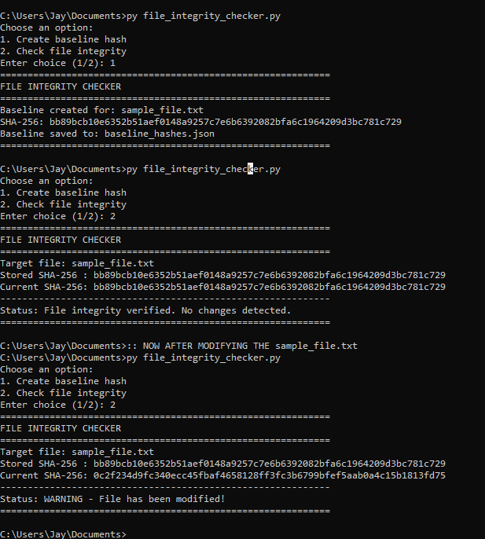

# File Integrity Checker

A Python-based cybersecurity project that uses SHA-256 hashing to detect file modifications by comparing current and baseline hashes.

## Purpose
This project was built to understand how file integrity monitoring works in cybersecurity by detecting whether a file has been changed after a trusted baseline was created.

## Features
- Generates a SHA-256 hash for a file.
- Stores a baseline hash in a JSON file.
- Compares the current file hash with the stored baseline.
- Detects whether the file is unchanged or modified.
- Prints a simple integrity-check report in the terminal.

## How It Works
The script works in two steps:

### 1. Create baseline
- Reads the target file.
- Calculates its SHA-256 hash.
- Saves the hash into a JSON baseline file.

### 2. Check integrity
- Reads the current file content.
- Recalculates the SHA-256 hash.
- Compares it with the saved baseline hash.
- Reports whether the file is unchanged or modified.

## Files Included
- `file_integrity_checker.py` — main Python script
- `sample_file.txt` — sample file to monitor
- `baseline_hashes.json` — generated baseline hash file
- `file-integrity-output.jpg` — sample output screenshot

## Example Use
This project simulates a simple file integrity monitoring task used in cybersecurity to detect possible tampering or unauthorized modification of important files.

## Sample Output
The script first creates a trusted baseline hash for the target file. It can then verify whether the file remains unchanged or detect if the file has been modified by comparing the current SHA-256 hash with the stored baseline.

## Ethical Note
This project is for educational purposes only. It demonstrates basic file integrity monitoring using sample local files.

## Concepts Practiced
- SHA-256 hashing
- File integrity monitoring
- Baseline creation and verification
- JSON storage
- Detecting unauthorized file modification

## Future Improvements
- Support multiple files
- Monitor directories
- Add automatic repeated checks
- Export reports to CSV
- Add alert notifications

## Author
Jay Prakash  
GitHub: [jayprakash-tech](https://github.com/jayprakash-tech)
